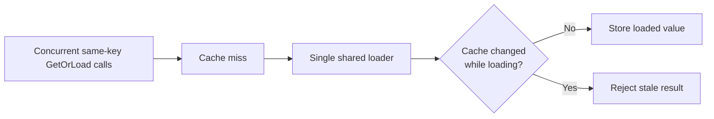
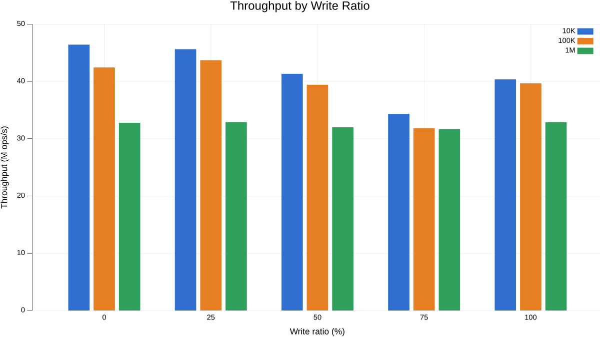
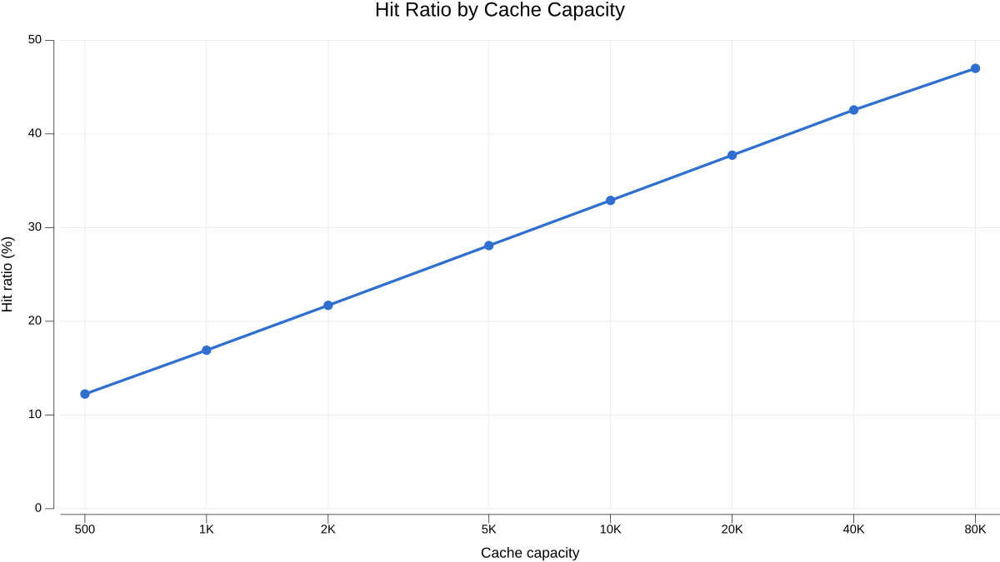
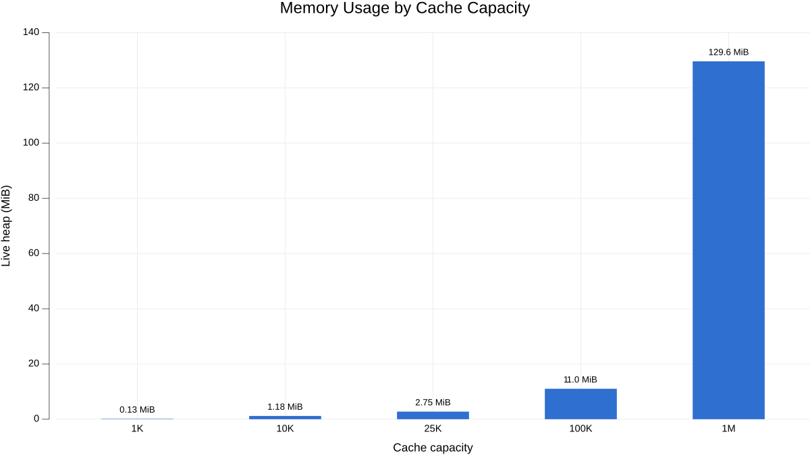

# pacecache


**Fast and concurrent in-memory cache for Go**

[](https://pkg.go.dev/github.com/mkbeh/pacecache)
[](https://github.com/mkbeh/pacecache/actions/workflows/test.yml)
[](https://codecov.io/gh/mkbeh/pacecache)
[](LICENSE)

`pacecache` is a bounded, generic in-process cache for Go, built for highly concurrent workloads. It combines segmented
LRU storage, flexible expiration, cache-aside loading, and optional observability while keeping resident hot paths
allocation-free.

The library provides an intuitive API with predictable behavior under high concurrency and contention.

<br clear="right">

## Features

* **Built for Concurrency:** Uses segmented storage to minimize lock contention under heavy load.
* **Bounded LRU Eviction:** Enforces exact LRU eviction within each segment with configurable cache capacity.
* **Flexible Expiration:** Supports cache-level and per-entry TTLs, jitter, sliding expiration, explicit TTL refreshes,
  and entries without time-based expiration.
* **Cache-Aside Loading:** Coalesces concurrent misses for the same key to prevent cache stampedes.
* **Concurrency-Safe Updates:** Prevents stale in-flight loads from overwriting newer cache state.
* **Expiration Cleanup:** Supports lazy expiration, explicit cleanup, and an optional background cleanup worker.
* **Observability:** Provides built-in statistics and optional OpenTelemetry metrics for monitoring cache behavior.
* **Allocation-Free Hot Paths:** Avoids per-operation allocations for common cache hits, misses, and updates.

## Installation

This repository contains the core `pacecache` module. The core package is released from the repository root:

```bash
go get github.com/mkbeh/pacecache
```

Optional OpenTelemetry metrics are available through `paceotel`:

```bash
go get github.com/mkbeh/pacecache/extra/paceotel
```

## Usage

Create a cache with `pacecache.New` and close it when it is no longer needed:

<!-- @formatter:off -->
```go
cache, err := pacecache.New[string, string]("cache")
if err != nil {
    panic(err)
}
defer cache.Close()
```
<!-- @formatter:on -->

Entries do not expire by default. Use `WithTTL` to set the default expiration and `WithJitter` to spread expiration
deadlines and reduce synchronized expiration bursts. Individual entries can use the default TTL, a custom TTL, or
`NoExpiration`.

<!-- @formatter:off -->
```go
cache, _ := pacecache.New[string, string](
    "cache",
    pacecache.WithTTL(5*time.Minute),
    pacecache.WithJitter(30*time.Second),
)
defer cache.Close()
```
<!-- @formatter:on -->

Values can be stored, retrieved, checked, conditionally inserted, and invalidated:

<!-- @formatter:off -->
```go
// Store values with different expiration strategies.
cache.Set("key1", "value1", pacecache.DefaultExpiration) // cache-level TTL
cache.Set("key2", "value2", pacecache.NoExpiration)      // no expiration
cache.Set("key3", "value3", 30*time.Second)              // custom TTL

// Read a live value.
value, found := cache.Get("key1")

// Read a value together with its expiration metadata.
entry, found := cache.GetEntry("key1")

// Check existence without updating LRU or TTL.
exists := cache.Exists("key2")

// Atomically return an existing value or store a new one.
value, found = cache.GetOrSet("key4", "value4", pacecache.DefaultExpiration)
entry, found = cache.GetOrSetEntry("key5", "value5", 30*time.Second)

// Invalidate cached values.
value, found = cache.GetAndInvalidate("key3") // read and invalidate atomically
cache.Invalidate("key1")                      // invalidate one key
cache.Invalidate("key2", "key4")              // invalidate multiple keys
cache.InvalidateAll()                         // clear the cache
```
<!-- @formatter:on -->

`GetOrLoad` can lazily load values on cache misses. The loader runs only when no live entry exists, and successful
results are stored using the cache's default expiration:

<!-- @formatter:off -->
```go
// Define a loader that fetches the value from an upstream source.
loader := pacecache.Loader[string](
    func(ctx context.Context) (string, bool, error) {
        // Load from a database, file, or remote service.
        return "loaded value", true, nil
    },
)

// Return the cached value or invoke the loader on a miss.
value, found, err := cache.GetOrLoad(ctx, "key", loader)
if err != nil {
    log.Printf("failed to load key: %v", err)
    return
}

if found {
    fmt.Println("retrieved value:", value)
}
```
<!-- @formatter:on -->

Missing results and loader errors are returned without being cached. Concurrent misses for the same key share a single
loader execution, avoiding duplicate requests to the upstream source.

Expired entries are never returned and are removed lazily when encountered. Periodic background cleanup can be enabled
for entries that may remain untouched, or expired entries can be reclaimed explicitly when needed.

<!-- @formatter:off -->
```go
cache, _ := pacecache.New[string, string](
    "cache",
    pacecache.WithTTL(5*time.Minute),
    pacecache.WithCleanupInterval(time.Minute), // background cleanup
)
defer cache.Close()

// Or reclaim expired entries explicitly.
cache.CleanupExpired()
```
<!-- @formatter:on -->

Background cleanup is optional. `Close` stops the cleanup worker and waits for it to exit.

## Concurrency semantics

The cache coordinates concurrent loads and mutations to prevent duplicate upstream work and stale values from
overwriting newer cache state. The flow below shows how a shared in-flight load is handled when the cache is mutated
before the loader completes:



Concurrent misses for the same key share a single loader execution, while different keys are loaded independently. If
the cache is mutated while a load is in flight, the newer mutation takes precedence. The stale loaded value is discarded
instead of overwriting the newer cache state, and the loading call returns an error.

Callers waiting for a shared load can stop waiting through their own `context.Context` without blocking other waiting
callers.

## Observability

The cache provides built-in runtime statistics and optional OpenTelemetry metrics for monitoring cache behavior.

`Stats` returns a snapshot of the current cache state and cumulative activity:

<!-- @formatter:off -->
```go
// Retrieve a snapshot of the current cache state and activity.
stats := cache.Stats()

// Selected statistics available in the snapshot.
_ = stats.EntryCount      // Current live entries
_ = stats.MaxEntries      // Configured maximum capacity
_ = stats.HitCount        // Cache hits
_ = stats.MissCount       // Cache misses
_ = stats.EvictionCount   // LRU evictions
_ = stats.ExpirationCount // Expired entries removed
_ = stats.LoadErrorCount  // Loader errors
```
<!-- @formatter:on -->

Statistics also include load outcomes, shared and superseded loads, invalidations, cleanup activity, and segment count.

Optional OpenTelemetry metrics are available through [paceotel](./extra/paceotel). OpenTelemetry configuration and
exporter selection remain application concerns, so Prometheus, OTLP, and other exporters can be used without changing
the cache integration.

For a complete setup, see the [example](./examples/otel).

## Performance

The benchmark suite evaluates concurrent throughput, cache hit ratio, and memory consumption under representative cache
workloads.

Benchmarks were run on an Intel Core i7-12700H (14 cores, 20 threads).

---

### Throughput

Measures concurrent read/write throughput using a pre-generated Scrambled Zipfian access pattern to create skewed key
access and hot-key contention.

* **Concurrency:** 8 parallel workers
* **Segments:** 512
* **Maximum entries:** 10K, 100K, and 1M
* **Write ratios:** 0%, 25%, 50%, 75%, and 100%
* **Expiration:** Disabled



---

### Hit Ratio

Measures how cache capacity affects hit ratio under a Zipfian access pattern.

* **Requests:** 1,000,000
* **Segments:** 32
* **Capacity:** 500 to 80K entries
* **Expiration:** Disabled to isolate capacity and eviction behavior



---

### Memory Consumption

Measures live heap consumption after populating the cache with fixed-size keys and values.

* **Data:** Fixed 32-byte keys and 32-byte values
* **Segments:** 32
* **Capacity:** 1K to 1M entries
* **Expiration:** 1-hour TTL



---

For the complete methodology, source code, and execution instructions, see the
[performance benchmarks](./benchmarks/performance).

## Examples

See the [examples](./examples) directory for runnable examples demonstrating how to use `pacecache`.

## License

This project is licensed under the [MIT License](LICENSE).